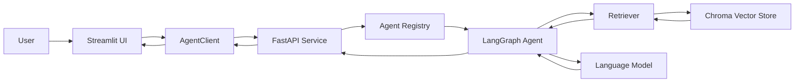

# 📄 DocPilot — Evaluable Document RAG Agent

[](https://github.com/wuchenxiaodao/docpilot-rag-agent/actions/workflows/test.yml)
[](https://www.python.org/)
[](https://fastapi.tiangolo.com/)
[](https://langchain-ai.github.io/langgraph/)
[](./LICENSE)

DocPilot is a document-grounded RAG agent built for **measurable retrieval quality, traceable answers, and production-oriented streaming**.

Instead of treating RAG as a black-box demo, DocPilot includes a frozen evaluation set, semantic chunking experiments, retrieval diagnostics, source-grounded responses, and an end-to-end FastAPI + Streamlit application.

> This repository is adapted from [JoshuaC215/agent-service-toolkit](https://github.com/JoshuaC215/agent-service-toolkit). The service framework originates from the upstream project; the document RAG pipeline, retrieval evaluation, semantic chunking experiments, and DocPilot-specific reliability work are the focus of this fork.

---

## Why DocPilot?

A RAG system can produce fluent answers even when retrieval is wrong.

DocPilot therefore evaluates retrieval independently from generation and makes the following questions observable:

- Was the correct evidence retrieved?
- At which rank did the correct evidence appear?
- Can all evidence required by a multi-hop question be retrieved together?
- Does the final answer stay within the retrieved documents?
- Can the response expose its sources?
- What happens when retrieval, generation, or streaming fails?

The goal is not only to build a document chatbot, but to build a RAG system whose behavior can be **measured, diagnosed, and improved**.

---

## Current Retrieval Results

The current frozen evaluation set contains **50 questions**:

- **35 answerable questions** with labeled supporting evidence
- **15 unanswerable / out-of-domain questions**
- **10 multi-hop questions** requiring more than one evidence chunk

### Retrieval metrics

| Metric | Result |
|---|---:|
| Recall@1 | **32/35 (91.4%)** |
| Recall@3 | **34/35 (97.1%)** |
| MRR | **0.938** |
| Multi-hop full-coverage@3 | **7/10 (70.0%)** |

### Metric definitions

- **Recall@1**: percentage of answerable questions whose labeled evidence is ranked first.
- **Recall@3**: percentage of answerable questions whose labeled evidence appears in the top three results.
- **MRR**: Mean Reciprocal Rank of the first correct evidence chunk.
- **Multi-hop full-coverage@3**: percentage of multi-hop questions for which all required evidence chunks appear in the top three results.

### Why is the Recall denominator 35 instead of 50?

Recall is calculated over the **35 answerable questions** because those questions have labeled supporting evidence that retrieval is expected to find.

The remaining 15 questions are intentionally unanswerable or out of domain. They are used to evaluate rejection and grounding behavior rather than evidence recall.

This separation prevents an unanswerable question from being incorrectly counted as a retrieval miss when no valid evidence exists in the corpus.

> Evaluation results are tied to the frozen corpus, question set, chunking strategy, embedding configuration, and `top-k` settings. They should not be interpreted as universal benchmark results.

---

## Key Features

### Document-grounded answers

DocPilot retrieves relevant document chunks before generation and instructs the model to answer primarily from the retrieved evidence.

If the available evidence is insufficient, the agent should explicitly say so instead of inventing an answer.

### Traceable sources

Retrieved chunks retain source metadata so the final response can identify the documents used to produce an answer.

### Semantic chunking

The project includes experiments for replacing coarse page-level chunks with smaller, semantically coherent chunks.

This reduces embedding dilution when one page contains several unrelated sections.

### Frozen retrieval evaluation

A fixed question set and labeled evidence set make retrieval changes comparable across experiments.

The evaluation reports:

- Recall@1
- Recall@3
- MRR
- Per-question ranks
- Retrieval misses
- Multi-hop evidence coverage
- Out-of-domain behavior

### Retrieval diagnostics

Diagnostic scripts expose retrieved chunks, ranks, scores, and failure cases instead of reporting only an aggregate metric.

This makes it possible to distinguish between:

- chunking failures;
- embedding failures;
- query-encoding failures;
- `top-k` limitations;
- multi-hop coverage failures;
- generation failures.

### Streaming API

The service supports streamed responses through FastAPI and an asynchronous client.

The main streaming path is:

```text
Streamlit UI
    → AgentClient.astream()
    → FastAPI
    → LangGraph agent
    → retrieval and model generation
    → StreamingResponse / SSE
    → AgentClient
    → Streamlit UI
```

The client consumes the response incrementally and uses an explicit completion signal to identify the end of a stream.

### Unified service architecture

DocPilot retains the reusable service foundation of `agent-service-toolkit`:

- LangGraph agent orchestration
- FastAPI service layer
- asynchronous Python client
- Streamlit interface
- Pydantic request and response models
- streaming and non-streaming endpoints
- Docker-based local environment
- automated tests

---

## System Architecture




### Request lifecycle

1. The user submits a document-related question in the Streamlit interface.
2. `AgentClient` serializes the request and sends it to the FastAPI service.
3. FastAPI validates the request with Pydantic.
4. The agent registry selects the configured LangGraph agent.
5. The retriever searches the vector store for relevant chunks.
6. Retrieved content and source metadata are added to the model context.
7. The model generates a grounded answer.
8. The service returns either a complete response or a streamed response.
9. The client parses the response and renders it in the UI.

---

## RAG Pipeline

```text
PDF / DOCX documents
        ↓
Text extraction
        ↓
Semantic chunking
        ↓
Embedding generation
        ↓
Chroma vector store
        ↓
Top-k retrieval
        ↓
Retrieved evidence + metadata
        ↓
LangGraph agent
        ↓
Grounded answer with sources
```

### Retrieval improvement process

DocPilot follows an experiment-first workflow:

1. Freeze the corpus and evaluation questions.
2. Run the current retrieval configuration as a baseline.
3. Inspect per-question retrieval results.
4. Identify the dominant failure mode.
5. Change one retrieval variable at a time.
6. Rebuild the vector store when chunk boundaries change.
7. Re-run the same frozen evaluation set.
8. Compare metrics and regression cases.
9. Promote a change only when the evidence supports it.

This avoids tuning the system based on a few hand-picked examples.

---

## Chunking: The Main Retrieval Bottleneck

Early experiments used page-level chunks. A single page could contain several topics, such as:

- company mission and values;
- working hours;
- remote-work policy;
- security guidance;
- leave policy.

Embedding the entire page into one vector diluted the representation of each individual topic. Shorter, keyword-dense chunks could then outrank the correct page even for unrelated questions.

DocPilot addresses this with semantic chunking:

- split documents around section and meaning boundaries;
- keep related sentences together;
- avoid combining unrelated policies in one vector;
- preserve source and section metadata;
- verify chunk boundaries through retrieval evaluation.

The experiment history is available under [`experiments/`](./experiments/).

---

## Repository Structure

```text
docpilot-rag-agent/
├── data/
│   └── AcmeTech_Employee_Handbook.pdf
├── docs/
│   ├── architecture.md
│   └── RAG_Assistant.md
├── experiments/
│   ├── create_semantic_chunk_db.py
│   ├── retrieval_diagnostic.py
│   ├── retrieval-quality-v1.md
│   └── semantic_chunker.py
├── media/
│   ├── agent_architecture.png
│   └── app_screenshot.png
├── scripts/
│   ├── create_chroma_db.py
│   ├── smoke_live_app.py
│   └── smoke_test.sh
├── src/
│   ├── agents/
│   │   ├── agents.py
│   │   ├── knowledge_base_agent.py
│   │   └── rag_assistant.py
│   ├── client/
│   │   └── client.py
│   ├── core/
│   ├── schema/
│   ├── service/
│   │   └── service.py
│   ├── run_service.py
│   └── streamlit_app.py
├── tests/
├── compose.yaml
├── pyproject.toml
└── README.md
```

---

## Tech Stack

| Layer | Technology |
|---|---|
| Agent orchestration | LangGraph |
| API service | FastAPI |
| Validation | Pydantic |
| Async HTTP client | HTTPX |
| User interface | Streamlit |
| Vector store | Chroma |
| RAG framework | LangChain |
| Document parsing | PyPDF, docx2txt |
| Testing | pytest |
| Environment management | uv |
| Containerization | Docker Compose |

The repository supports multiple model providers through the underlying service framework. At least one compatible model provider must be configured before starting the application.

---

## Quickstart

### Prerequisites

- Python **3.12–3.14**
- [`uv`](https://docs.astral.sh/uv/)
- At least one supported LLM API key or local model configuration
- Docker and Docker Compose, if using the containerized setup

### 1. Clone the repository

```bash
git clone https://github.com/wuchenxiaodao/docpilot-rag-agent.git
cd docpilot-rag-agent
```

### 2. Create the environment file

```bash
cp .env.example .env
```

Open `.env` and configure at least one supported model provider.

Do not commit real API keys or credential files.

### 3. Install dependencies

Install `uv` if it is not already available:

```bash
curl -LsSf https://astral.sh/uv/install.sh | sh
```

Install the project dependencies:

```bash
uv sync --frozen
```

Activate the virtual environment:

```bash
source .venv/bin/activate
```

On Windows PowerShell:

```powershell
.venv\Scripts\Activate.ps1
```

### 4. Prepare the vector store

For the basic Chroma pipeline:

```bash
python scripts/create_chroma_db.py
```

For the semantic-chunking experiment:

```bash
python experiments/create_semantic_chunk_db.py
```

The exact embedding model and device configuration may need to be adjusted for the local environment.

### 5. Start the FastAPI service

```bash
python src/run_service.py
```

By default, the API is available at `http://localhost:8080`.

API documentation:

```text
http://localhost:8080/docs
http://localhost:8080/redoc
```

### 6. Start the Streamlit interface

In a second terminal:

```bash
source .venv/bin/activate
streamlit run src/streamlit_app.py
```

The interface is normally available at `http://localhost:8501`.

---

## Run with Docker

Create the local environment file first:

```bash
cp .env.example .env
```

Add the required model credentials to `.env`, then start the services:

```bash
docker compose watch
```

Alternatively:

```bash
docker compose up --build
```

The main services are exposed at:

- Streamlit UI: `http://localhost:8501`
- FastAPI service: `http://localhost:8080`
- OpenAPI documentation: `http://localhost:8080/docs`

Stop the services with:

```bash
docker compose down
```

---

## Run the Retrieval Evaluation

Run the retrieval diagnostics with:

```bash
python experiments/retrieval_diagnostic.py
```

The diagnostic workflow reports the retrieved chunks for each question together with their ranks and scores.

When comparing experiments, keep these variables fixed unless they are the explicit subject of the experiment:

- corpus version;
- frozen question set;
- evidence labels;
- embedding model;
- chunking version;
- vector-store configuration;
- `top-k`;
- metric implementation.

If chunk boundaries or document embeddings change, rebuild the vector store before running the evaluation.

---

## Testing

Run the test suite:

```bash
pytest
```

Run with coverage:

```bash
pytest --cov=src
```

Run formatting and static checks:

```bash
ruff check .
ruff format --check .
```

The repository also contains optional smoke tests for integrations that require live infrastructure:

```bash
./scripts/smoke_test.sh
```

Run only the smoke-test target related to the component being changed when possible.

---

## Example Evaluation Interpretation

Assume a question's labeled evidence first appears at rank 2:

```text
Rank 1: unrelated chunk
Rank 2: correct evidence
Rank 3: partially related chunk
```

For this question:

- Recall@1 contribution: `0`
- Recall@3 contribution: `1`
- Reciprocal rank: `1/2`

For a multi-hop question requiring chunks A and B:

```text
Top 3 results: A, C, B
```

The question counts as full-coverage@3 because both required chunks are present.

If only A appears in the top three, the question does not count as full coverage even if A alone is highly relevant.

---

## Grounding Policy

The RAG agent is designed around the following rules:

1. Use retrieved documents as the primary source of truth.
2. Do not invent information that is absent from the retrieved evidence.
3. State clearly when the evidence is insufficient.
4. Preserve source metadata for traceability.
5. Acknowledge conflicts when retrieved documents disagree.
6. Separate retrieval quality from generation quality during evaluation.

These rules reduce unsupported answers, but they do not guarantee that every generated response is correct. Production use still requires domain-specific evaluation and monitoring.

---

## Known Limitations

- Current benchmark results are based on a small, project-specific corpus.
- Retrieval metrics do not directly measure final-answer correctness.
- Multi-hop retrieval still has room for improvement.
- Results can change when the embedding model, chunk boundaries, or corpus changes.
- Similarity scores are not calibrated probabilities.
- Out-of-domain rejection requires separate evaluation from answerable-question recall.
- Local embedding models may require significant memory or GPU resources.
- The Streamlit interface is intended primarily as a development and demonstration client.

---

## Current Engineering Focus

- Improve multi-hop full evidence coverage.
- Make SSE timeout behavior explicit and testable.
- Standardize error responses across streaming and non-streaming endpoints.
- Handle client disconnects and coroutine cancellation safely.
- Prevent blocking work from stalling the async event loop.
- Add end-to-end observability for retrieval, generation, completion, and failure events.
- Extend evaluation from retrieval quality to grounded-answer quality.

---

## Roadmap

- [x] Document ingestion for PDF and DOCX
- [x] Chroma-based vector retrieval
- [x] Source-aware grounded generation
- [x] Frozen retrieval evaluation set
- [x] Recall@1, Recall@3, and MRR reporting
- [x] Semantic chunking experiments
- [x] Per-question retrieval diagnostics
- [x] Multi-hop evidence coverage evaluation
- [ ] Improve multi-hop full-coverage@3
- [ ] Complete SSE timeout and disconnect handling
- [ ] Unify streaming and non-streaming error contracts
- [ ] Add generation-level faithfulness evaluation
- [ ] Add repeatable end-to-end benchmark commands
- [ ] Add a deployable public demo

---

## Upstream Attribution

DocPilot is based on [`JoshuaC215/agent-service-toolkit`](https://github.com/JoshuaC215/agent-service-toolkit), which provides the original LangGraph, FastAPI, client, and Streamlit service framework.

This fork focuses on adapting that framework into an evaluable document RAG system, including:

- document-specific retrieval;
- semantic chunking experiments;
- frozen evaluation data;
- retrieval-quality metrics;
- multi-hop coverage analysis;
- grounded-answer behavior;
- streaming reliability work.

Please refer to the upstream repository for the original framework and its broader collection of example agents and integrations.

---

## Security

- Never commit `.env` files containing real secrets.
- Never commit private credential files.
- Use placeholder credentials in tests.
- Review logs before sharing them because retrieved document text may contain sensitive information.
- Treat uploaded documents as untrusted input in production deployments.

---

## License

This project is licensed under the [MIT License](./LICENSE).

The original upstream project is also distributed under the MIT License. See the repository history and upstream project for attribution details.
